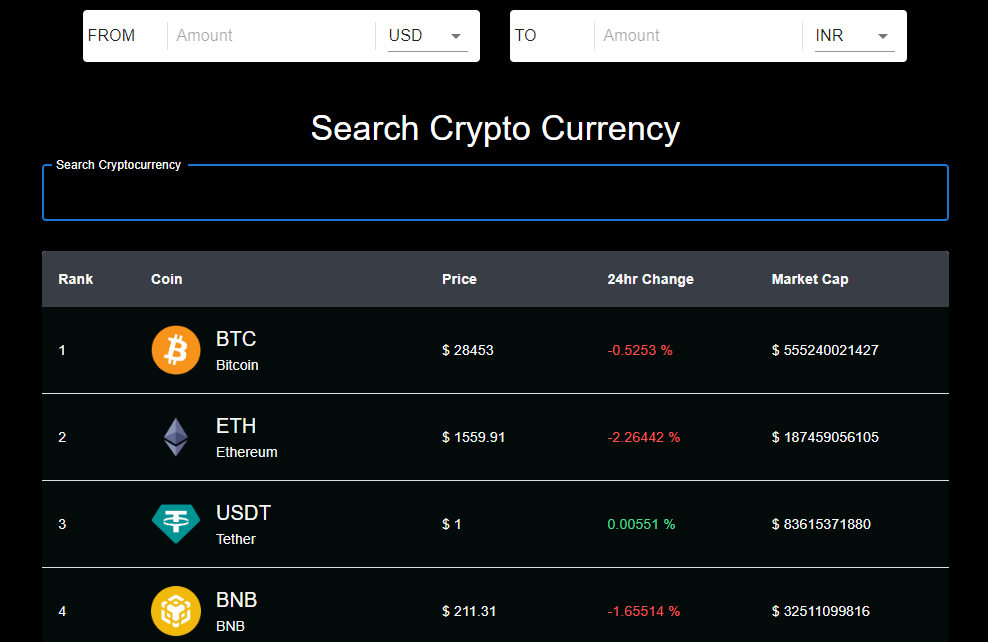

# Crypto Marketer

Welcome to the Crypto Hunter! This website allows you to easily track the real-time prices, market capitalizations, and rankings of various cryptocurrencies.

## Screenshots

## Features

- Real-time tracking of cryptocurrency prices and market cap values
- Convert from one currency to another
- Supports multiple currencies (INR, USD, EUR ...)
- Real-time exchange rates
- Supports Table Pagination for getting as many coins as you want
- Line chart for viewing price changes over a selected time period
- Favorite list for easy tracking of specific cryptocurrencies
- Historical price data and information about total supply, circulation, trading volume, and market dominance
- Responsive design, can be seen at any screen
- Dockerized app for easier installation

## Tech Stack

- [React](https://reactjs.org/)
- [Redux Toolkit](https://redux-toolkit.js.org/)
- [Material UI](https://mui.com/)
- [Chart Js](https://www.chartjs.org/)
- [Firebase](https://firebase.google.com/)
